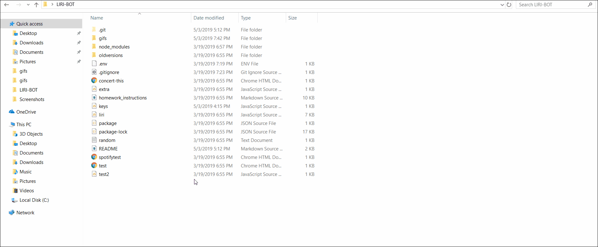

# LIRI-BOT

The LIRI BOT-9000 is a command-line application that allows users to search for information on movies, songs, and bands. 

## How to use

The repository can be cloned by clicking the Clone or Download button on the main repository page, then clicking the button next to the url which appears below. Then open a Terminal or Git Bash window, navigate to the location where you want to place the cloned repository, then type 'git clone' and then paste the repository that was just copied.

The user can run the application by navigating into the repository and typing 'node liri.js' in their terminal, followed by one of four commands - 'spotify-this-song', 'movie-this', 'concert-this', and 'do-what-it-says'. If ths user enters 'node liri.js' without choosing a command, the program will output the message 'Please enter a command'.
  

  
Entering 'spotify-this-song' followed by the name of a song returns information on the song from the Spotify API, as well as a preview link for the song, if available. 
  

  
If the user enters the command without the name of a song, the default results will be for "The Sign" by Ace of Base. 
  

  
Entering 'movie-this' followed by a movie title returns information on the movie from the OMDB API.
  

  
If this command is entered without a movie title, the default results will be for Mr. Nobody.
  

  
Entering 'concert-this' followed by an artist or band returns touring and concert information on the artist or band from the Bandsintown API.
  

  
If the user doesn't enter an artist name, the program will output a message that says "Please choose an artist to search for."
  

  
Finally, entering 'do-what-it-says' will retrieve text from a text file called random.txt., which consists of the name of one of the other three commands and a search term; it will then execute the command with that search term.
  

  

  
## Technology used
* JavaScript
* Nodejs
* Node packages:
  * Axios, Dotenv, Moment
* APIs: 
  *  OMDB, Spotify, Bandsintown

## Future improvements
The code in this application could perhaps be simplified while preserving the same functionality, such as by using fewer if-then statements in the everything function. 
